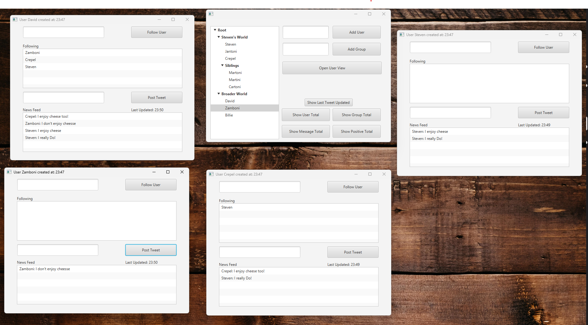
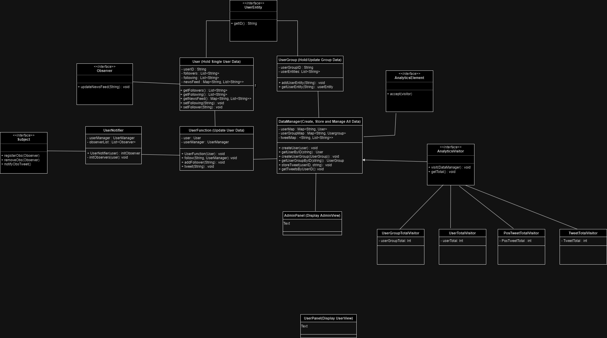

# java-mini-twitter

A university assigned, object-oriented project aimed at utilizing learned designer patterns.

## Java Mini Twitter Overview

This project is a Mini Twitter application written in Java, with a JavaFX GUI. It is a desktop application without web or mobile components. The purpose is to demonstrate the application of learned design patterns to construct an extensible software system.

## Features

- **Admin Control Panel**: Centralized dashboard to create and manage users and user groups.
- **User Management**: Each user has a unique ID, a list of followers, followings, and a news feed containing Twitter messages.
- **User Groups**: Support for creating user groups with unique IDs, where each user can belong to only one group. User groups can recursively contain other user groups, with a root group encompassing all entities.
- **Following Mechanism**: Users can follow others by entering the target user's ID. The application does not require an unfollow feature.
- **Tweet Posting**: Users can post tweets, which are then visible in their own and their followers' news feeds.
- **Analytics**: The admin panel offers analytics on the total number of users, groups, tweets, and the percentage of positive tweets based on hard-coded, pre-defined words. No AI is used.

## User Interface

- **Admin Control Panel**: The main entry point of the application, allowing for the addition of users/groups and providing analytics.
- **User View**: Accessible by selecting a user in the admin panel, it displays the users followed and the news feed. Users can follow others and post new tweets from this view.
- **Tree View**: All newly created users and user groups are grouped under hierarchical tree view.
- **Group Notation**: Groups are visually distinguished from users within the UI.
- **Real-Time Updates**: News feeds are automatically refreshed whenever new tweets are posted.

## Design Patterns used in application implementation:

- **Singleton**: Ensures a single instance of the admin control panel.
- **Observer**: Used for updating follower news feeds.
- **Visitor**: Facilitates basic function coherence.
- **Composite**: Used for the breakdown of tree elements as Entities.

## Screenshots

GUI Screenshot:

UML Diagram:

